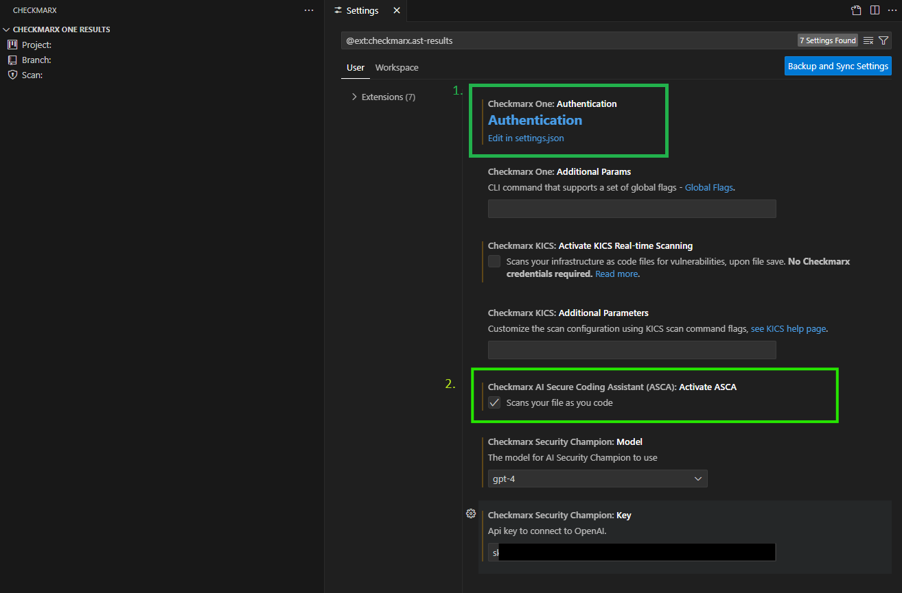

# Lab 1: Environment Setup

## Introduction
In this lab, we will focus on configuring our environment using an IDE and the Checkmarx plugin.  While Checkmarx supports multiple IDEs, for these labs we will be leveraging __Microsoft Visual Studio Code__, as it is free and commonly used.  Checkmarx has integrated plugins with the following IDEs:

* IntelliJ
* Visual Studio
* VS Code

To learn more, checkout [Checkmarx Integrations with Popular IDEs](https://checkmarx.com/why-checkmarx/integrations/checkmarx-integrations-with-ides/) and [Checkmarx IDE Integration Documentation](https://docs.checkmarx.com/en/34965-68727-checkmarx-one-ide-plugins.html)

{: .warning }
For these labs, we are using a known vulnerable projects to demonstrate vulnerability detection and remediation capabilities.  Note that if this application is run, these applications can result in system crashes as a result of memory leaks, deadlock, JVM crashes, etc.  In these labs, we are only using Checkmarx solutions that scan source code, thus there is no reason or need to run this project and __it is not recommended to do so__. If you do wish to run the project, do so at your own risk. It is HIGHLY recommended you do so in a sandbox environment (e.g. within a VM).

## Install VS Code
The first step is to install VS Code, if you don't already have it installed.

{: .note }
If you already have VS Code installed, you can skip this section. When we are done with the lab, you can always uninstall/disable the Checkmarx plugin

1. Navigate to [https://code.visualstudio.com/download](https://code.visualstudio.com/download) to download the Visual Studio Code installer for your operating system.
2. Install VS Code on your machine

## Install the Checkmarx Plugin
Once VS Code is installed, we need to install the Checkmarx plugin. The Visual Studio Code Extension is available on the [Visual Studio Code marketplace](https://marketplace.visualstudio.com/items?itemName=checkmarx.ast-results). You can initiate the installation directly from the Visual Studio Code console.

1. Open VS Code
2. Within VS Code, click the Extensions Icon
3. Type "Checkmarx" in the search prompt, then click __Install__ for that extension
    

    {: .note }
    Ensure you select the Plugin entitled "Checkmarx One" not Checkmarx SAST x.x

4. The Checkmarx extension is installed and the Checkmarx icon appears in the left-side navigation panel

    

## Configure the Checkmarx Plugin

1. In the VS Code console, click on the Checkmarx extension icon and then click on the Open settings button.  
   The Checkmarx Settings form opens.  
   

2. First you will need to authenticate the plugin by clicking the __Authentication__ link in box 1.  
   Once you click that, choose your method below to see the corresponding settings:

   {: .note }
   The preference for this workshop would be to use the Oauth authentication method. 

   

   

     <input type="radio" id="oauth-tab" name="auth-method" checked>
     <label for="oauth-tab">OAuth Authentication</label>
     
     <input type="radio" id="apikey-tab" name="auth-method">
     <label for="apikey-tab">API Key Authentication</label>
     
     

       
       

         The base URL for this lab will be: <code>https://us.ast.checkmarx.net</code>. 
         The Tenant Name will be delivered in the lab.
       

     

     

       
       

         To use the API Key option, the instructions can be found at 
         <a href="https://docs.checkmarx.com/en/34965-188712-creating-api-keys.html" target="_blank">Generating a Checkmarx API Key</a>.
       

     

   

  

3. Now that you have authenticated, in the Checkmarx AST plugin section, enter the following details:

    |         Item                          |          Value                |
    |:----------------------                |:-----------------------       |
    | Checkmarx One: Additional Params | \<leave blank\>                 |
    | Checkmarx KICS: Activate KICS Real-time Scanning | \<leave blank\>                 |
    | Checkmarx KICS: Additional Parameters | \<leave blank\> 
    | Checkmarx AI Secure Coding Assistant (ASCA): Activate ASCA | \<Enable\>                 |
    | Checkmarx Security Champion: Model  | __Optional:__ Choose a supported model                 |
    | Checkmarx Security Champion: Key    | __Optional:__ Utilize a GPT API-KEY from your organization               |

    {: .note }
    The AI Features may be disabled for your specific workshop due to organizational policy. 

4. Once entered, you have configured the plugin

5. Close the Plugin Settings Screen

## Connect to a project

1. Mouse-over the __Project:__ field in the left pane, click the pencil icon, then select the project name __TotallySecure__ that appears in the middle search bar

    

    {: .note }
    > Since Checkmarx plugin v2.34.0 release, only the AST/One API Key or Ouath is required to connect the plugin to a Checkmarx One tenant.  If you see a 404 error within VSCode when attempting to connect to a project while using the API Key option, it may be because environment variables are overriding the Uri/tenant names from the API key (cx_base_auth_uri, cx_base_uri, cx_tenant).  These variables are set if you've ever connected to Checkmarx One via the CLI. This can be fixed by deleting the checkmarxcli.yaml file if it exists on your machine.
    >
    > For Mac OSX and Linux, this file can be found at ~/.checkmarx/checkmarxcli.yaml
    >
    > For Windows, this file can be found at %UserProfile%\\.checkmarx\\checkmarxcli.yaml

2. Mouse-over the __Branch:__ field in the left pane, click the pencil icon, then select the branch __master__ that appears in the middle search bar

    

3. The Checkmarx Plugin is now configured and you should see scan results appear in the left pane

    

## Clone the project to your local machine

1. Open a terminal or command prompt and navigate to a directory or folder you'll be able to easily find (e.g. ~/ on Mac OSX and Linux or %UserProfile%/ on Windows)

2. Clone our example scanned project to your local machine.

        git clone https://github.com/HsecCx/workshop-TotallySecure.git

    {: .note }
    You will need __git__ installed on your local machine if it is not already installed. You can use [this guide ](https://github.com/git-guides/install-git) to see the steps for your operating system

3. Within VS Code, select __File__ > __Open Folder__, and select the directory __workshop-TotallySecure__.

4.  You may be prompted by VS Code asking if you trust the developers. We will not be executing any of this projects code and will just be reviewing the source, so you can safely accept. Once you complete the labs, you can safely delete the project.

    '

## Key Takeaways
- Checkmarx has IDE plugins for all major IDEs
- The Checkmarx One VS Code plugin is available within the Visual Studio Marketplace and is distinct from the Checkmarx SAST plugin
- The Checkmarx One VS Code plugin can be connected to a Checkmarx One instance by configuring one field (the API Key)
- Checkmarx Scan results can be reviewed all within the IDE
- Docker is required for IaC/KICS autoremediation within VS Code

