# Lab 2: Custom Code Analysis

{: .important-title }
> Prerequisites
>
> We will be using our __TotallySecure__ project, which is available at https://github.com/HsecCx/workshop-TotallySecure. If you have not already done so, clone the project to your local machine, as defined in [Lab 1](../lab1_setup/).

## Introduction
SAST, or Static Application Security Testing, enables developers and security teams to scan application source code to find, index, and enumerate weaknesses that lead to vulnerabilities within the application.  Checkmarx supports [over 30 languages and frameworks](https://docs.checkmarx.com/en/34965-149060-sast-scanner---supported-languages-and-frameworks.html) and leverages a set of configurable scan presets, which affords AppSec and dev teams the ability to hone the results and only focus on the results they care about.

Checkmarx SAST scans source code, not binaries, allowing teams to scan incomplete or partial code, affording an iterative approach to security. And because Checkmarx One integrates seamlessly with SCMs (GitHub, GitLab, BitBucket, Azure), we can automatically trigger scans during push and pull request events, eliminating the need to manually trigger or schedule scans

Out-of-the-box, SAST on Checkmarx One uses an optimized preset.  This preset contains a subset of vulnerabilities that the Checkmarx AppSec Accelerator team, through years of research and first-hand experience with our customers, considers to be an optimal balance between identifying critical vulnerabilities while minimizing false positives.

In addition to presets, Checkmarx SAST supports the ability to customize queries, allowing organizations to add or modify queries to help reduce false positives, add queries for custom sanitizers, or to resolve false negatives.

### Fast vs Accurate
Often Custom Code Analysis (SAST) vendors claim they are "fastest" when scanning source code, but this is almost always at the expense of accuracy. Rather than focusing on scan speed, Checkmarx focuses on accuracy _at speed_, ensuring we have the highest "True Positive" (TP) within our findings.  Afterall, if you're not finding vulnerabilities, how can you fix them (e.g. False Negatives)? Depending on the project size and the code changes, our scan engine also supports Incremental Scans, so we only scan the changed code.

Sure, speed is important, but you can think of speed-focused SAST scans as this security guard checking folks:

  


## Reviewing SAST Results

1. Within the VS Code Checkmarx plugin, expand the latest Scan result.

    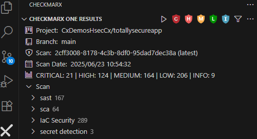

2. Click the __M__ (Medium), __L__ (Low), and __I__ (Info) icons to filter out everything other than the __H__ (High) and __C__ (Critical) results
    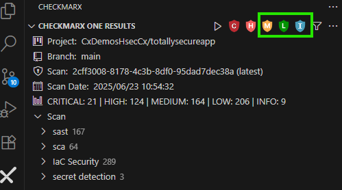

3. Expand the __sast > Critical__ menu in the left panel to review the SAST scan results
4. Select the __SQL Injection (/SQLInjectionController.java:30)__ result from the Critical findings

    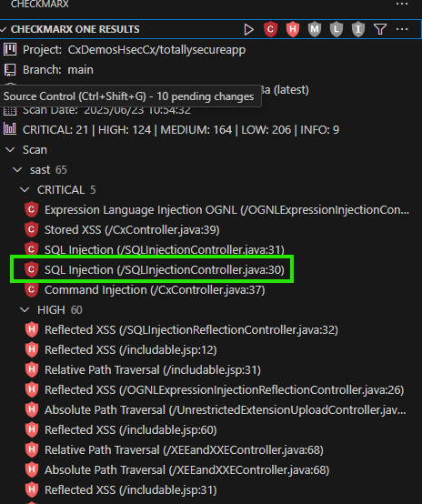

5. A pane will open with VS Code to the right, which provides a detailed description of the identified vulnerability along with the attack vector.

    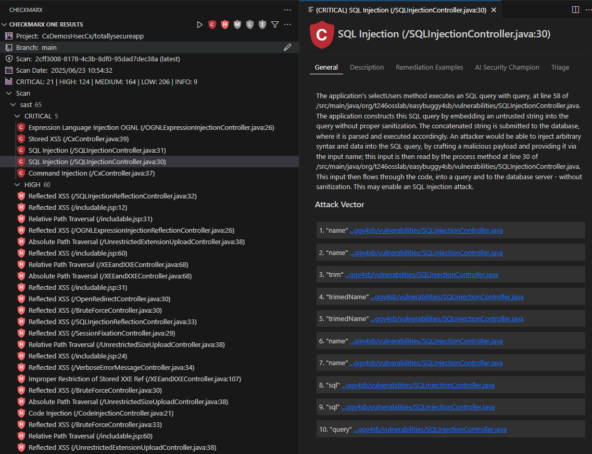

6. Because Checkmarx scans source code and builds a Data Flow Graph, it can identify the source and sink of vulnerabilities, identifying where best to implement a fix to resolve the vulnerability. Click on the first Attack Vector link, __1. "name" ...ggy4sb/vulnerabilities/SQLInjectionController.java [30:88]__, VS Code will open the specific file and highlight the parameter that Checkmarx has identified as the source of the vulnerability

    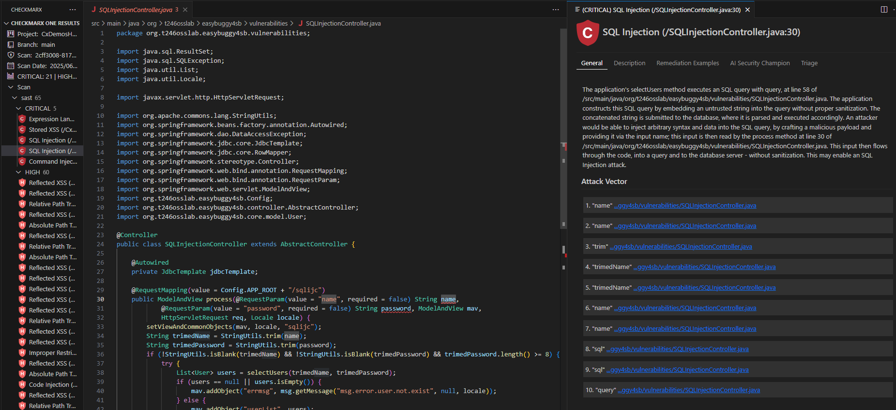

7. Reviewing the code, we can see within the result that we're taking direct input of a name and just trimming it and checking if it's blank, otherwise we pass on the input to be later executed as part of a SQL query, which could result in a SQL injection attack. Click on __Description__ in the far right pane to see a description of the risk in greater detail:

    {: .note }
    Note that right below the description there is the option to go to __Codebashing__, the Checkmarx One just-in-time training platform that provides interactive lessons on fixing the specific vulnerability you're viewing. 

    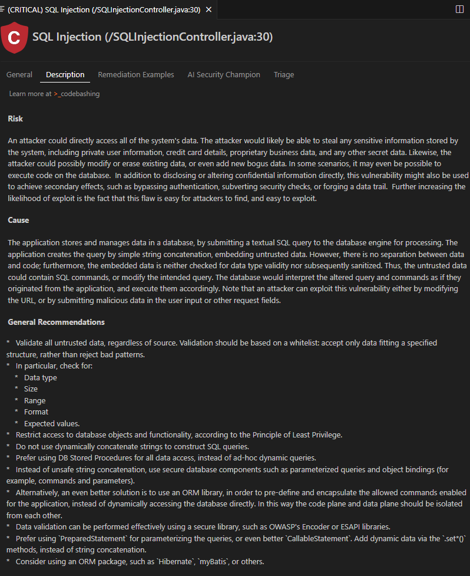

8. Click on __Remediation Examples__ to see an example of how to implement a sanitizer within the code to mitigate the SQL Injection vulnerability

    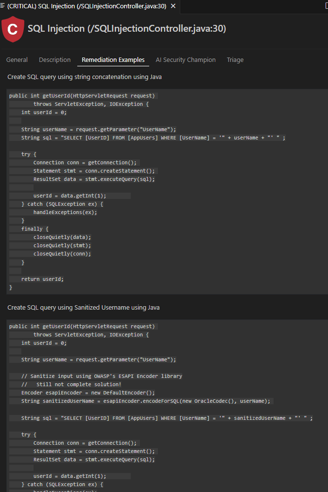

## AI Secure Coding Assistant (ASCA)

The AI Secure Coding Assistant (ASCA) is an advanced real-time scanning feature integrated into the Checkmarx VS Code extension. Unlike traditional SAST scans that occur after code is written, ASCA provides __instant security feedback as you type__, helping developers identify and fix security issues during development.

{: .note }
ASCA is evolving into "Developer Assist" with enhanced agentic AI capabilities. For the latest information on this evolution, visit [Checkmarx AI Platform](https://checkmarx.ai/) and access the full summit content.


### How ASCA Works

ASCA runs as a lightweight background process on your local machine, automatically scanning files whenever you edit them. After you pause typing for 2 seconds, or by pressing the spacebar on an empty line, ASCA performs a new scan and updates the results in real-time. The scan results appear within milliseconds, providing instant feedback without disrupting your development workflow.

### Key Features

- __Real-time Analysis__: Scans code as you type with sub-second response times
- __Local Processing__: Runs entirely on your local machine for privacy and speed  
- __Visual Indicators__: Color-coded underlines in your code indicate vulnerability severity
- __Problems Integration__: Results appear in VS Code's Problems panel
- __GitHub Copilot Integration__: Generate AI-powered remediation suggestions
- __Multiple Language Support__: Currently supports Java, JavaScript (Node.js), C#, and Python

### Viewing ASCA Results

1. __Open a vulnerable file__ by selecting the `src\main\java\org\t246osslab\easybuggy4sb\controller\CxController.java` file (note: Windows paths use backslashes, but the file structure is the same across operating systems)

2. __Generate a vulnerable function__ As an example to show how the scan takes place locally, as you modify the file, copy and paste the following function to the end of the selected file

    ```java
    @PostMapping("upload")
    public String uploadFile(@RequestParam("file") MultipartFile file) {
        try {
            // Save the uploaded file to the server's filesystem
            File uploadedFile = new File("/tmp/" + file.getOriginalFilename());
            try (FileOutputStream fos = new FileOutputStream(uploadedFile)) {
                fos.write(file.getBytes());
            }
            return "File uploaded successfully: " + uploadedFile.getAbsolutePath();
        } catch (IOException e) {
            e.printStackTrace();
            return "Failed to upload file.";
        }
    }

    ```

3. __Look for underlined code__: ASCA will automatically scan the file and show color-coded squiggly lines under problematic code. If you hover on the insecure code, ASCA will show you the reason for the finding. It will also denote at the end of the description that it was an ASCA finding. 

    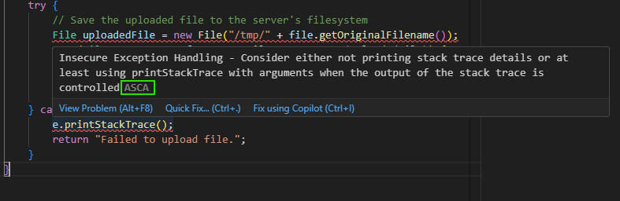

4. __Check the Problems panel__: Navigate to __View__ > __Problems__ to see a detailed list of ASCA findings

    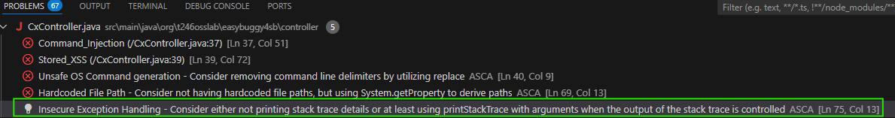

### AI-Powered Remediation with GitHub Copilot

If you have GitHub Copilot installed, ASCA can generate customized code fixes:

1. __Select the ASCA Result in the Problems Terminal__ and click the __lightbulb__ icon (Show Code Actions). You can select "Fix using Copilot" to generate a code fix or you can select the "Explain using Copilot" to generate a detailed explanation of the vulnerability with an example fix. 

    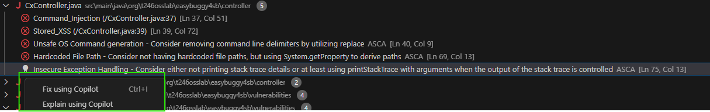


2. __Select "Fix using Copilot"__ from the context menu (this can be found by hovering over the vulnerability as seen in step 3 of the previous section). Here you can generate explanations and fixes inline without having to move to the problems pane. 

3. __Review the AI-generated fix__ - Copilot will provide a customized remediation based on ASCA's security knowledge
4. __Click "Accept"__ if satisfied with the suggestion
5. __Automatic rescan__: ASCA will immediately rescan and remove the issue if properly resolved

{: .note }
__Try It Now__: Generate a fix or explanation from the vulnerability we added. 

### ASCA vs Traditional SAST

| Feature | ASCA | Traditional SAST |
|---------|------|------------------|
| __Timing__ | Real-time (as you type) | On-demand or scheduled |
| __Scope__ | Single file | Entire codebase |
| __Speed__ | Milliseconds | Minutes to hours |
| __Location__ | Local machine | Cloud/server |
| __Integration__ | Problems panel, underlines | Separate results viewer |
| __Remediation__ | AI-powered with Copilot | Manual implementation |

{: .warning }
__Important Considerations__: ASCA results are __local only__ and do not sync with the Checkmarx One platform. ASCA analyzes __single files only__, not cross-file data flows. While ASCA provides valuable real-time feedback, it should __supplement__, not replace, comprehensive Checkmarx One scans.

## Triaging Results
While Checkmarx One can identify vulnerabilities in source code by validating that sanitizers are in place since it has visibility into data flow, it is relatively limited in its ability to detect control flow based validation.  Perhaps we have validation within our application that we know will ensure our code is not subject to a vulnerability. We have the ability to triage results from within the IDE where we can mark them as "Proposed Not Exploitable" so they can be reviewed to determine if they can be updated to "Not Exploitable" to prevent them from appearing in future results.

1. Navigate back to the SAST results and expand the __sast > High__ menu to find __Reflected XSS All Clients__ results.
2. Select any one of the __Reflected XSS All Clients__ results.

3. In the right pane, change the second drop down from __To Verify__ to __Proposed Not Exploitable__ and enter a comment, such as

        We have a validator in our code to ensure that this variable will only include known inputs.

    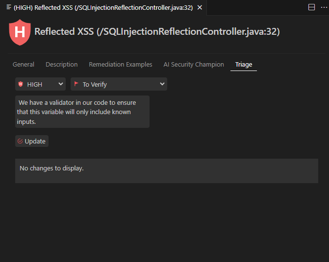

4. Click __Update__

5. The result will now disappear from the SAST High results.  If we want to review the result again, we can select the filter icon, and de-select all options other than __"Proposed Not Exploitable"__
    
    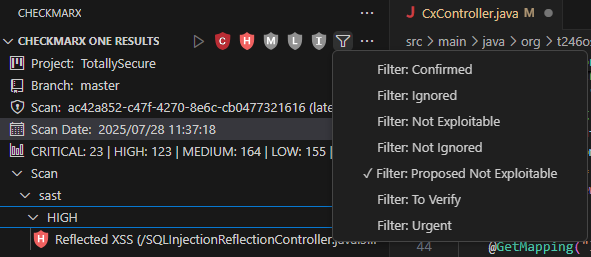


## Key Takeaways
- Checkmarx SAST scans source code rather than binaries, allowing dev teams to iteratively scan code as they build
- Checkmarx One integrates with all major SCMs and can automatically trigger scans on push and pull request events
- SAST results are viewable directly within the IDE, so you don't have to navigate to a different tool or site to review results
- We can see the "Best Fix Location" along with a detailed analysis and recommendations within the IDE to implement controls within our code
- ASCA provides real-time security feedback as you type, complementing traditional SAST scans with instant local analysis
- AI-powered remediation through GitHub Copilot integration enables automatic fix generation for security vulnerabilities
- We have the ability to triage results from within the IDE where we can mark them as "Proposed Not Exploitable" so they can be reviewed to determine if they can be updated to "Not Exploitable" to prevent them from appearing in future results

