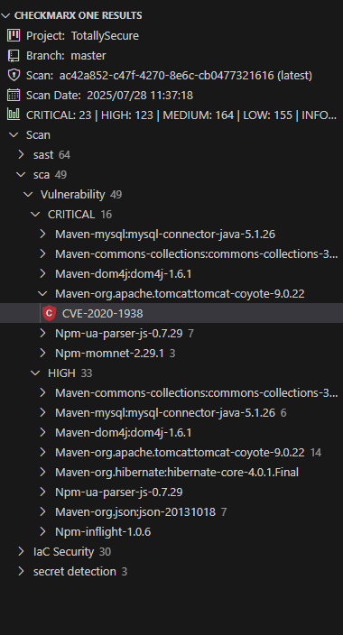
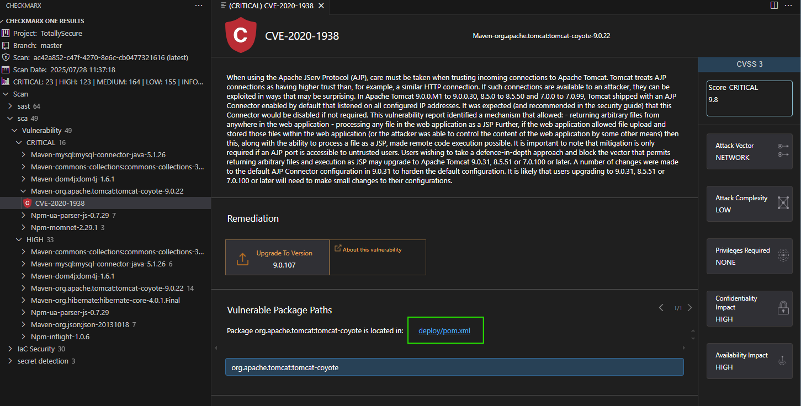
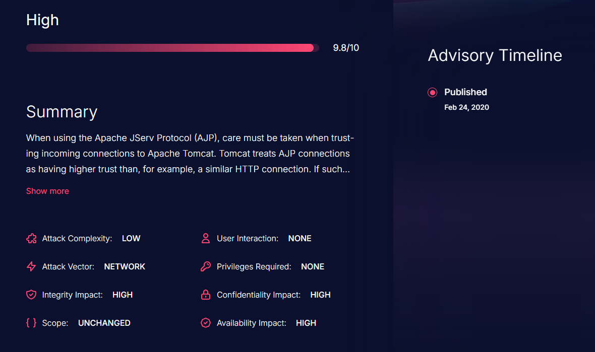

# Lab 3: 3rd Party Code Analysis
In this lab, we will explore some examples of Software Composition Analysis (SCA) vulnerabilities, and how to remediate them. 

{: .important-title }
> Prerequisites
>
> We will be using our __totallysecureapp__ project, which is available at https://github.com/cxworkshops/totallysecureapp. If you have not already done so, clone the project to your local machine, as defined in [Lab 1](../lab1_setup/).

## Introduction

With the accelerating adoption of open source software in their applications, organizations face the challenges of securing their applications when using open source or 3rd party dependencies.  With Checkmarx Software Composition Analysis, organizations can better track, assess, and remediate their 3rd party package vulnerabilities and licensing risks within their projects before it’s too late.

Checkmarx SCA supports all major ecosystems and package managers.  A comprehensive list of supported languages and package managers can be found [here](https://checkmarx.com/resource/documents/en/34965-117822-supported-languages-and-package-managers.html)  


## Reviewing SCA Results

Within the Checkmarx VS Code plugin, ensure you are connected to the project, branch, and scan result as noted in the __Connect to a project__ section in [Lab 1](../lab1_setup/).

1. Navigate to the Checkmarx Plugin in the left menu of VS Code, expand the sca results, and Critical results

    {: .note }
    Malicious Packages will always be returned in SCA Critical results. We look at malicious packages in a different lab focused on __Supply Chain Security (SCS)__

    

2. Expand the __Maven-org.apache.tomcat:tomcat-coyote-9.0.22__ result

3. Choose __CVE-2020-1938__ and review the description within the pane opened within VS Code.

    ```
    When using the Apache JServ Protocol (AJP), care must be taken when trusting incoming connections to Apache Tomcat. Tomcat treats AJP connections as having higher trust than, for example, a similar HTTP connection. If such connections are available to an attacker, they can be exploited in ways that may be surprising. In Apache Tomcat 9.0.0.M1 to 9.0.0.30, 8.5.0 to 8.5.50 and 7.0.0 to 7.0.99, Tomcat shipped with an AJP Connector enabled by default that listened on all configured IP addresses. It was expected (and recommended in the security guide) that this Connector would be disabled if not required. This vulnerability report identified a mechanism that allowed: - returning arbitrary files from anywhere in the web application - processing any file in the web application as a JSP Further, if the web application allowed file upload and stored those files within the web application (or the attacker was able to control the content of the web application by some other means) then this, along with the ability to process a file as a JSP, made remote code execution possible. It is important to note that mitigation is only required if an AJP port is accessible to untrusted users. Users wishing to take a defence-in-depth approach and block the vector that permits returning arbitrary files and execution as JSP may upgrade to Apache Tomcat 9.0.31, 8.5.51 or 7.0.100 or later. A number of changes were made to the default AJP Connector configuration in 9.0.31 to harden the default configuration. It is likely that users upgrading to 9.0.31, 8.5.51 or 7.0.100 or later will need to make small changes to their configurations.  
    ```

4. We can see the recommended remediation is to __Upgrade To Version 9.0.107__. Additionally there is a link to the vulnerable package path, which is found within deploy/pom.xml.  Click on __deploy/pom.xml__.

    

5.  Within the __deploy/pom.xml__ file, we can update the Tomcat version from __9.0.22__ to version __9.0.107__.

    {: .note }
    While Checkmarx SCA will often have recommendations to upgrade package versions to address found vulnerabilities, we understand it's not always as simple as just changing a version.  We recommend when upgrading package versions, you do so one at a time in a test or staging environment and performing a regression test to ensure no functionality is broken or lost within your application.  In the event that application functionality is affected, we recommend you coordinate with your internal Security organization to define a remediation plan or implement other mitigation steps to minimize the impact of the vulnerability

## Learning more about SCA Results

1. Aside from built-in result information within the Checkmarx Plugin in VSCode, there is a wealth of information available on [Checkmarx's DevHub, devhub.checkmarx.com](https://devhub.checkmarx.com):

    

2. You can see this same result available within the [Vulnerabilities Database](https://devhub.checkmarx.com/cve-details/CVE-2020-1938/).

3. In addition to DevHub, Checkmarx also can provide email notifications of when new vulnerabilities arise related to previously discovered packages within your projects

    

## Key Takeaways

- Checkmarx SCA identifies vulnerabilities in 3rd party dependencies and open source packages across all major ecosystems
- Critical vulnerabilities like CVE-2020-1938 can pose significant security risks including remote code execution
- Package remediation often involves upgrading to newer versions, but requires careful testing to avoid breaking changes
- Checkmarx is constantly monitoring, testing, and updating its database for 3rd party packages for tracking vulnerabilities
- Checkmarx SCA can automatically email you or your security champion when new vulnerabilities are detected within previously identified packages
- Vulnerability data is available in a number of areas, including the Checkmarx One VS Code plugin, [Checkmarx DevHub Vulnerabilities Database](https://devhub.checkmarx.com/advisories/), or within the Checkmarx One web interface itself
- DevHub provides comprehensive vulnerability details, attack vectors, and remediation guidance for better understanding
