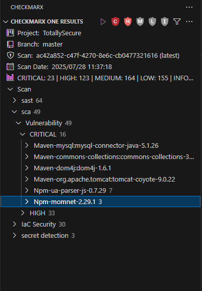
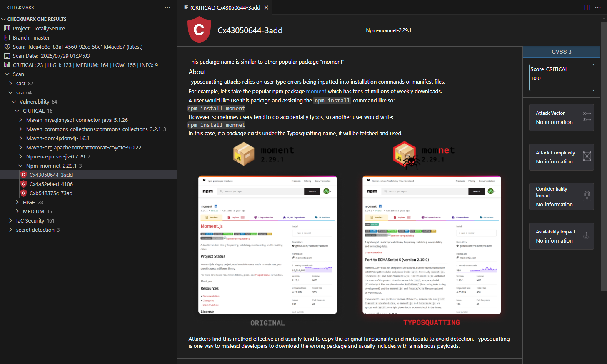
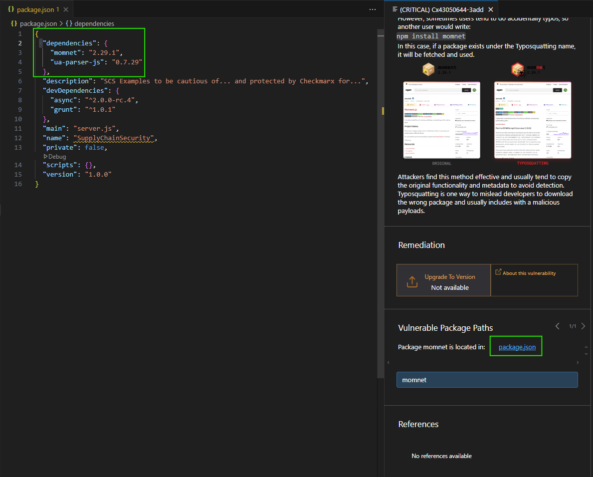
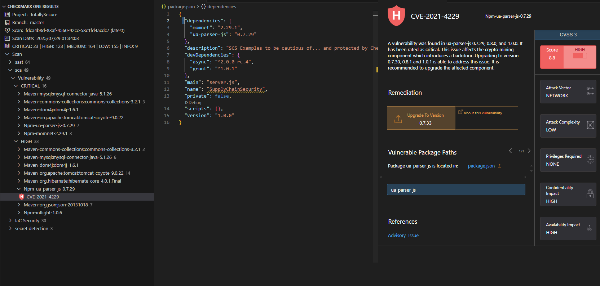
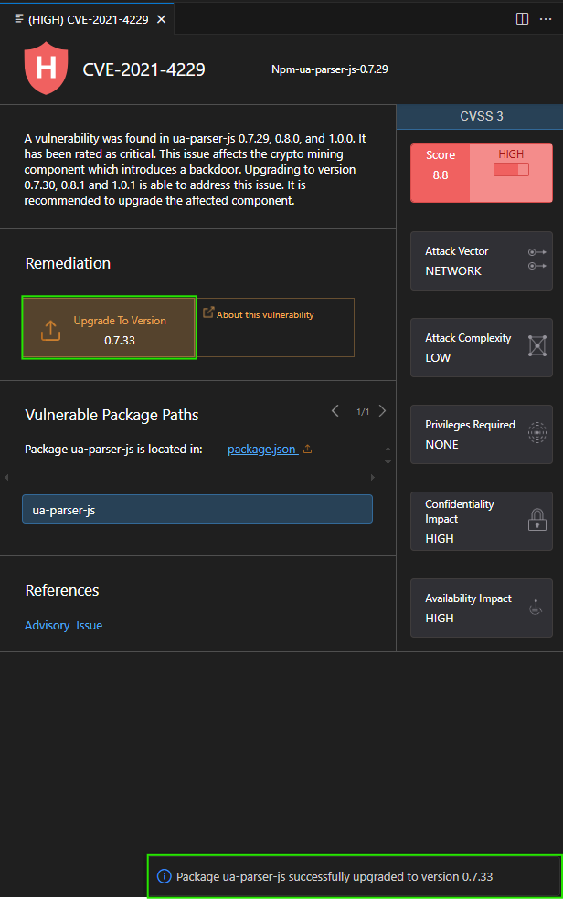

# Lab 4: Malicious Package Detection
In this lab, we will explore some examples of Malicious Package findings, and how to remediate them. 

{: .important-title }
> Prerequisites
>
> We will be using our __TotallySecure__ project, which is available at https://github.com/HsecCx/workshop-TotallySecure. If you have not already done so, clone the project to your local machine, as defined in [Lab 1](../lab1_setup/).

{: .note }
While we are reviewing malicious packages in this lab, we won't be executing any of the project code (and for that matter, even if you did run the project, the malicious packages aren't actually used within the project), so there is no risk of introducing malicious packages into your system.

## Introduction

A good developer is an efficient developer and part of being an efficient developer is not re-inventing the wheel for every project or solution. As a result, many of us leverage the benefits of freely available open source software and/or packages to save time and effort and let us achieve our functionality and features faster. And while these open source solutions save significant time, effort, and headaches, importing others' code into our projects exposes us to potential risks and vulnerabilities we otherwise wouldn't face if we developed all of our code ourselves.

### What are Supply Chain Attacks?

Supply chain attacks target the dependencies and packages your application relies on:

- __TypoSquatting__: Attackers create packages with names similar to popular packages (e.g., "momnet" vs "moment")
- __RepoJacking__: Attackers compromise legitimate package repositories to inject malicious code
- __Dependency Confusion__: Attackers publish malicious packages to public registries with the same name as private packages
- __Package Tampering__: Attackers modify legitimate packages during distribution to include malicious code
- __LLM Hallucination Exploitation__: Attackers create packages with names suggested by AI tools
- __And more__: Including account takeovers, compromised build tools, and malicious CI/CD pipeline attacks

## Reviewing Malicious SCA Results

Malicious Package results are included in the Checkmarx SCA scan engine. Within the Checkmarx VS Code plugin, ensure you are connected to the project, branch, and scan result as noted in the __Connect to a project__ section in [Lab 1](../lab1_setup/).

{: .note }
Malicious packages are also detectable through Application Security Posture Management (ASPM) capabilities, which provide another way to easily filter and prioritize these threats.

1. Navigate to the Checkmarx Plugin in the left menu of VS Code and expand the latest scan result

2. Expand the __sca__ section to view Software Composition Analysis results

3. Look for the grouping dropdown or icon in the SCA results panel and select "Group by Severity"

4. Expand the __Critical__ section to see the most severe vulnerabilities, including malicious packages

    

{: .note }
Note that to date, unlike vulnerabilities where we have a common standard of CVE, there is no standardized universal ID for malicious packages. For example, IDs of the same incident:
- cx-2021-b8833-be2146 (Checkmarx)
- SNYK-JS-RC-1911120 (Snyk)
- sonatype-2021-1696 (Sonatype)
- GHSA-g2q5-5433-rhrf (GitHub)

## Attack Type 1: TypoSquatting

TypoSquatting attacks exploit common typos in popular package names to trick developers into installing malicious packages.

1. Expand the __Npm-momnet-2.29.1__ result, and select the __Cx43050644-3add__ result. Note how a new pane opens at the far right with a description of the malicious package.

    

2. Per the malicious package description, we can see this is a malicious package using the __Typo Squatting__ attack. The package creators are hoping that a developer mistypes "moment" and accidentally imports their package instead, which includes a malicious method that deletes the inner HTML body and crashes the app.

3. We can fix this malicious package by clicking on the Vulnerable package path which links to package.json and changing the package name from __momnet__ to __moment__:

    

## Attack Type 2: RepoJacking

RepoJacking involves account takeovers to inject malicious code into legitimate packages.

1. Navigate back to the SCA results and expand the __High__ section

2. Expand the __Npm-ua-parser-js-0.7.29__ result and select __CVE-2021-4229__

    

3. Reviewing the malicious package description, we can see that ua-parser-js had three versions published with malicious code. The three affected versions (0.7.29, 0.8.0, and 1.0.0) were the result of an account takeover, otherwise known as __Repojacking__. We can see in the remediation advice that we can upgrade to version 0.7.33 to ensure we are not importing an affected version.

4. Click on "Upgrade to Version," and the Checkmarx plugin will automatically update our package version within package.json to 0.7.33

    

## Attack Type 3: LLM Hallucination Exploitation

A growing threat in the era of AI-assisted development is the exploitation of Large Language Model (LLM) hallucinations. As developers increasingly rely on AI tools like ChatGPT, GitHub Copilot, and other coding assistants, a new attack vector has emerged.

### LLM Hallucination Examples

1. __Hallucinated Package Names__: LLMs sometimes suggest packages that don't actually exist, creating fictitious names that sound plausible
2. __Dependency Confusion__: When asked for solutions, LLMs may "invent" package names that seem legitimate but are completely fabricated
3. __Malicious Package Creation__: Attackers monitor for commonly hallucinated package names and create malicious packages with those exact names
4. __Slopsquatting__: A form of supply chain attack where attackers capitalize on LLM hallucinations or typos to register unused, plausible-sounding package names "squatting" on AI-generated slop in the ecosystem.
5. __Developer Trust__: Developers trust AI suggestions and install these packages without verification

### Real-World Examples

- __"huggingface-cli"__: An LLM suggested this non-existent package for reinforcement learning, which researchers then created, which then lead to 30k downloads in a few months
- __"langchain-helpers"__: Multiple LLMs suggested this package name for extended functionality, creating an opportunity for malicious package squatting
- __Framework-specific utilities__: LLMs often suggest packages like "react-utils-advanced" or "vue-helper-tools" that don't exist but sound legitimate

{: .warning }
__Best Practice__: Always verify package existence and legitimacy before installation, especially when using AI-generated suggestions. Check the package's download count, last update date, and repository activity.

## Key Takeaways

- __Malicious Package vs Vulnerable Package__: A malicious package contains intentionally harmful code designed to cause damage (e.g., deleting files, stealing data, crypto mining), while a vulnerable package contains unintentional security flaws that can be exploited by attackers
- Malicious Package results are included in Checkmarx SCA results
- Unlike vulnerabilities where we have CVEs, malicious packages don't have a standardized identifier
- Supply Chain Attacks can be surprisingly unsophisticated, but easily executed
- TypoSquatting exploits common typos in popular package names (e.g., "momnet" vs "moment")
- RepoJacking involves account takeovers to inject malicious code into legitimate packages
- LLM Hallucination Exploitation is an emerging threat where attackers create packages with names suggested by AI tools
- Always verify package existence and legitimacy before installation, especially when using AI-generated suggestions
- The Checkmarx VS Code plugin allows for auto-remediation of specific package versions
- Malicious packages are also detectable through Application Security Posture Management (ASPM) capabilities
