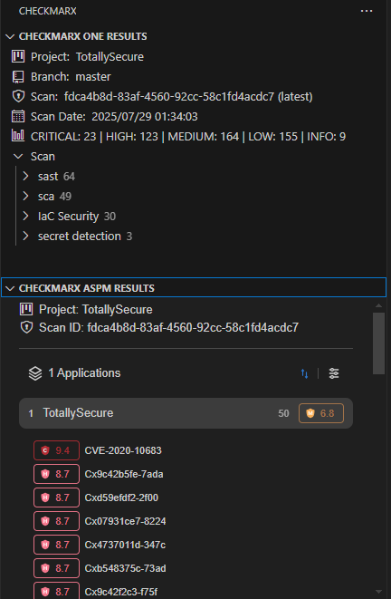
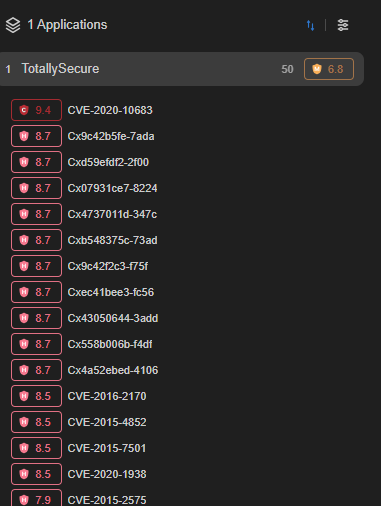
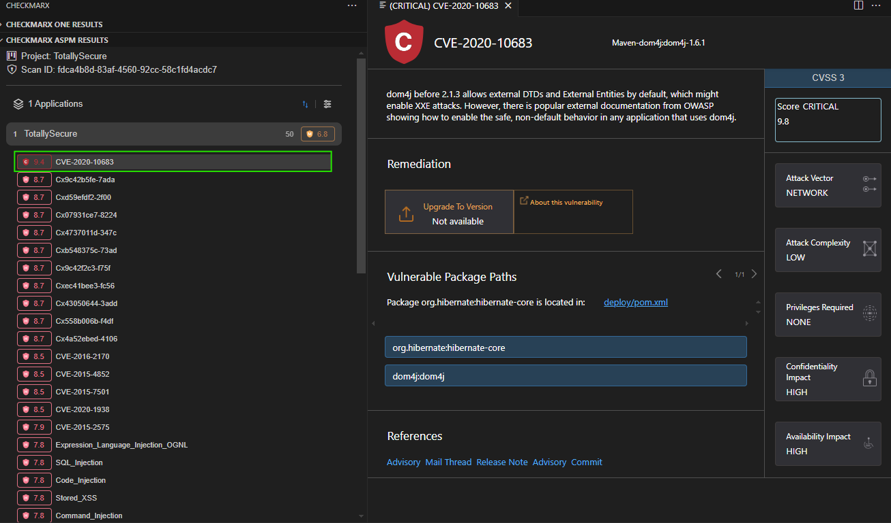
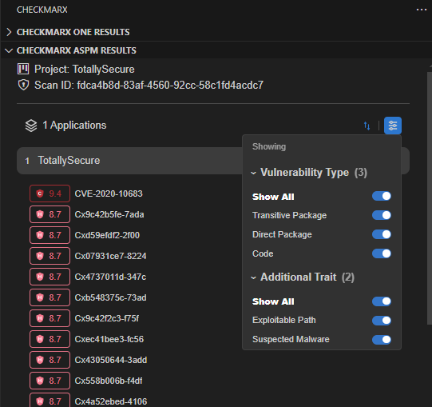

# Lab 5: Application Security Posture Management (ASPM)

{: .important-title }
> Prerequisites
>
> We will be using our __TotallySecure__ project, which is available at https://github.com/HsecCx/workshop-TotallySecure. If you have not already done so, clone the project to your local machine, as defined in [Lab 1](../lab1_setup/).

## Introduction

Application Security Posture Management (ASPM) is a comprehensive risk management tool that enables you to understand and prioritize the risks associated with your applications. Rather than viewing security findings in isolation by scanner type, ASPM consolidates results from multiple sources to present a holistic view of your application security posture.

ASPM helps security teams and developers:
- __Prioritize remediation tasks__ based on business impact and risk scoring
- __Understand application-wide risk__ across all security domains
- __Focus on the most critical vulnerabilities__ that pose real threats
- __Track security improvements__ over time at the application level

The Checkmarx One VS Code extension includes a dedicated ASPM section that brings this enterprise-level risk management directly into your development environment.

{: .note }
ASPM in VS Code provides a project-focused view of application risks, showing up to 50 of the most severe risks associated with the current project. As of now this applies to SAST, SCA, IAC with other engines being added soon.

## Understanding ASPM in VS Code

### ASPM vs Individual Scanners

Traditional security scanning approaches show results by scanner type:
- __SAST Results__: Code vulnerabilities
- __SCA Results__: Dependency vulnerabilities  
- __IAC Results__: Infrastructure as Code vulnerabilities

__ASPM takes a different approach__ by:
- Aggregating ALL security findings across scanners
- Applying risk scoring based on exploitability and business impact
- Prioritizing based on application context
- Showing the "big picture" of application security health

## Accessing ASPM Results in VS Code

1. __Ensure Project Association__: ASPM data is only shown when your project is associated with a Checkmarx One application

2. __Navigate to the ASPM Section__: In the Checkmarx VS Code extension panel, look for the dedicated ASPM section (separate from individual scan results)

    

3. __View Application Risks__: The ASPM section displays applications associated with your current project, showing the most severe risks for each

    

{: .warning }
__Important__: If your selected project is not associated with any applications, no ASPM data will be shown. ASPM data is only displayed when viewing the most recent scan of the selected project.

## Exploring ASPM Risk Data

### Understanding Risk Categories

ASPM categorizes security findings into logical groups:

| Category | Scanner Source | Description |
|----------|----------------|-------------|
| __Code__ | SAST | Source code vulnerabilities |
| __Direct Package__ | SCA | Direct dependency vulnerabilities |
| __Transitive Package__ | SCA | Indirect dependency vulnerabilities |
| __Mixed__ | SCA | Complex dependency chains |
| __Configuration__ | IAC Security | Infrastructure misconfigurations |
| __Imported Results__ | BYOR | Third-party security tool findings |

### Analyzing Individual Risks

1. __Click on an Application__ to expand and view its associated risks

2. __Review Risk Details__: Each risk shows:
   - Risk severity and score
   - Business impact assessment

3. __Deep Dive into Risks__: Click on any risk to open detailed information in the same view used for individual scan results

    

### Advanced Risk Traits

ASPM identifies risks with additional concerning characteristics:

- __Suspected Malware__: Packages flagged as potentially malicious
- __Exploitable Path__: Vulnerabilities with known exploitation vectors
- __High Business Impact__: Risks affecting critical application components

## Sorting and Filtering ASPM Data

### Sorting Options

Click the sort icon to organize applications by:
- __Risk Score__ (highest to lowest)
- __Application Name A→Z__
- __Application Name Z→A__

### Dynamic Filtering

The filter icon provides dynamic filtering based on your application's actual findings:

1. __Filter by Risk Type__: Toggle visibility for Code, Direct Package, Transitive Package, Configuration, etc.

2. __Filter by Risk Traits__: Show/hide risks with special characteristics like:
   - Suspected Malware
   - Exploitable Path
   - Other identified risk factors

    

{: .note }
Filtering options are __dynamic__ - you'll only see toggles for risk types and traits that actually exist in your application's findings.

## ASPM Best Practices

### Prioritization Strategy

1. __Start with Critical Risks__: Focus on highest-scored risks first
2. __Consider Exploitability__: Prioritize risks with known exploitation paths
3. __Review Malware Flags__: Immediately address suspected malicious packages
4. __Balance Technical and Business Impact__: Consider both severity and business context

### Workflow Integration

- __Daily Development__: Check ASPM view for new critical risks
- __Sprint Planning__: Use risk scores to prioritize security work
- __Release Decisions__: Review overall application risk posture
- __Security Reviews__: Use ASPM as a comprehensive security dashboard

{: .note }
ASPM provides the "big picture" view that helps you understand not just individual vulnerabilities, but how they collectively impact your application's security posture. This holistic approach enables better decision-making and more effective risk management.

## Key Takeaways

- __ASPM provides holistic risk management__ by aggregating findings across all security scanners
- __Risk prioritization__ helps focus remediation efforts on the most critical threats
- __Application-centric view__ shows security posture at the business application level rather than individual scan results
- __Dynamic filtering and sorting__ enables efficient risk assessment and triage
- __VS Code integration__ brings enterprise-level risk management directly into the development workflow
- __Risk categorization__ (Code, Package, Configuration, etc.) helps understand the source and nature of security threats
- __Advanced risk traits__ like Suspected Malware and Exploitable Path provide additional context for prioritization
- __ASPM complements individual scanners__ by providing the "big picture" view while maintaining drill-down capabilities to specific findings

